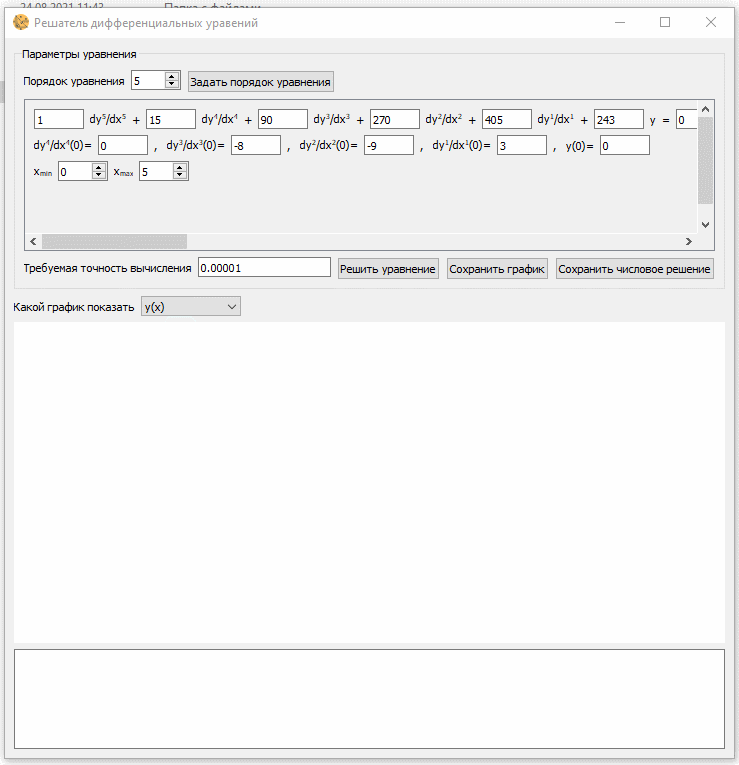

# solution_of_differential_equations
Приложение с графическим интерфейсом для решения обыкновенных дифференциальных уравнений методом Рунге-Кутты четвертого порядка.

## Запуск на Windows

1. Перейдите в папку `scripts` и запустите скрипт `install.bat`:

   ```bash
   install.bat
   ```

2. Запустите скрипт `run.bat`:

   ```bash
   run.bat
   ```

## Запуск на Linux

1. Перейдите в папку `scripts` и запустите скрипт `install.sh`:

   ```bash
   bash install.sh
   ```

2. Запустите скрипт `run.sh`:

   ```bash
   bash run.sh
   ```

## Выпуск релиза на Windows

Перейдите в папку `scripts` и запустите скрипт `release.sh`:

```bash
release.sh
```

## Выпуск релиза на Linux

Перейдите в папку `scripts` и запустите скрипт `release.sh`:

```bash
bash release.sh
```

## Возможности приложения

1. Приложение позволяет задать порядок `n` обыкновенного дифференциального уравнения.
2. Приложение позволяет задать коэффициенты уравнения.
3. Приложение позволяет задать граничные условия.
4. Приложение позволяет задать отрезок, на котором нужно найти решение.
5. Приложение решает обыкновенное дифференциальное уравнение порядка `n` методом Рунге-Кутты четвертого порядка.
6. Приложение рисует график решения.
7. Приложение позволяет сохранить график в формате `png` и `jpg`.
8. Приложение позволяет сохранить решение в `xlsx` и `txt` файлы.

## Пример работы приложения

Ниже можно посмотреть пример работы приложения:



## Примечание

Работа приложения проверялась на Windows 10 64-bit с Python 3.6.8 и Ubuntu 18 64-bit c Python 3.6.8.
